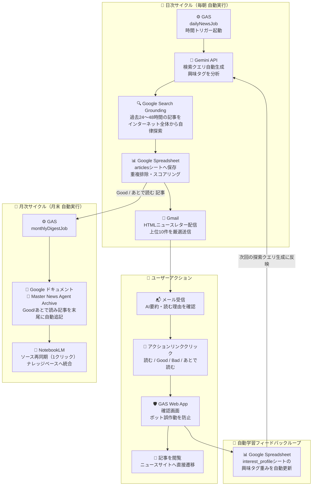

# Personal News Agent (PNA)

Gemini APIとGoogle Apps Script (GAS) を使用して、自身の興味に合わせた最新ニュースを自動で収集・整理するリサーチ支援ツールです。

---

## 概要

このプロジェクトは、Gemini APIの「Google検索グラウンディング（リアルタイムWeb検索機能）」を利用して、指定した興味タグに関する最新のニュース記事をGoogle検索経由で収集し、スプレッドシートへの保存およびGmailでの配信を行います。

また、配信されたメールからのフィードバック（Good/Bad/あとで読む）を通じてスプレッドシート内の興味プロファイルを学習し、探索用クエリを自動で調整します。

収集した記事のうち、評価の高いものはGoogleドキュメントに自動で集約され、NotebookLMのソースとして再同期することで簡単にナレッジ化（AIによる追加学習）できます。

### システム全体フロー




## 主な機能

### 1. Google検索を活用した自動探索 (Google Search Grounding)
設定した「興味タグ」や「優先巡回ドメイン」に基づき、AIが適切な検索用クエリを自動で生成し、過去24〜48時間以内の記事を自動で探索します。RSSフィードを手動で登録する手間がかかりません。

### 2. 興味プロファイルの自動学習
配信されたHTMLメール内のアクションリンク（Good/Bad/あとで読む）をクリックすると、スプレッドシート内の興味タグの重みが更新され、次回の探索クエリの生成に反映されるフィードバックループを備えています。

### 3. NotebookLMとの連携 (Googleドキュメント自動追記)
ユーザーが「Good」または「あとで読む」と評価した厳選記事のみを、Googleドライブ上の単一のマスタードキュメントの末尾に毎月自動で追記します。NotebookLMのソース画面から「再同期」を1クリックするだけで最新情報を反映できます。

### 4. 誤クリック防止の確認画面 (Web App)
メール配信システムやメーラーのセキュリティシステムが裏でリンクを自動スキャンし、評価データを汚してしまう（勝手にGood/Badが押される）のを防ぐため、確定ボタンを挟む一時確認画面をGASウェブアプリで提供します。

### 5. エラーリトライと動作制限対策
*   **自動リトライ (`fetchWithRetry`)**: 一時的な通信エラーやAPIの429/503混雑エラー発生時、自動で秒数を引き伸ばしながら最大3回まで再試行（指数バックオフ）します。
*   **API制限回避のスリープ**: 検索処理のループ間に10秒間の待機時間を挟み、無料枠や標準枠のAPI制限を回避します。
*   **GAS 6分実行制限ガード**: GASの最大連続実行時間（6分制限）に対応し、残り時間が1分未満になった時点で処理を安全に終了させ、そこまでの探索結果を壊さずにメール送信・保存を行います。
*   **最小限の権限設定 (`drive.file` スコープ)**: セキュリティを考慮し、Googleドライブ内のすべてのファイルではなく、このツールが自身で作成したファイルにのみアクセスを制限する安全な権限モデルを採用しています。

---

## 📂 ファイル構成

`news_agent_mvp/` ディレクトリ配下の構成は以下の通りです。

```text
news_agent_mvp/
├── appsscript.json        # GASのシステム設定ファイル（必要なOAuthスコープのみを明記）
├── Initialize.gs          # スプレッドシートDB（6枚のシート）を全自動生成する初期化スクリプト
├── Code.gs                # 自律探索の司令塔（毎朝動く dailyNewsJob エントリポイント）
├── SearchAgent.gs         # Gemini 3.5 Flash によるGoogle検索グラウンディングとクエリ生成のコア
├── Sheets.gs              # スプレッドシートDB操作、プロファイル管理、リトライ機能付きAPIラッパー
├── Notify.gs              # Gmail HTMLニュースレター配信
├── Actions.gs             # Webアプリ doGet(e) 処理（メールクリック時のアクション受付と自動学習）
└── MonthlyDigest.gs       # 厳選された Good/あとで読む 記事をマスターDocに自動アペンド
```

---

## 🛠️ セットアップ手順

詳細な導入手順は、リポジトリ内の [news_agent_mvp_walkthrough.md](news_agent_mvp_walkthrough.md) を参照してください。

### 1. スプレッドシートの作成と初期化
1. 空のGoogleスプレッドシートを新規作成します。
2. 「拡張機能」 -> 「Apps Script」を開きます。
3. ローカルの `Initialize.gs` の内容をコピー＆ペーストし、実行関数で `initSpreadsheet` を選択して **「実行」** します。

### 2. ローカル開発環境のセットアップ (任意・clasp推奨)
ローカルからコードをクラウドへ同期したい場合：
1. `npm install -g @google/clasp` を実行して clasp をインストールします。
2. `clasp login --no-localhost` を実行し、ブラウザで認証してログインします。
3. `news_agent_mvp` フォルダ内で、以下を実行して安全にスクリプトIDを紐付けます：
   ```powershell
   Set-Content -Path .clasp.json -Value '{"scriptId":"コピーしたスクリプトID"}'
   ```
4. `clasp push` を実行して、ローカルの最新コードを一括転送します。

### 3. アクション受付用 Web アプリのデプロイ
1. 右上「デプロイ」->「新しいデプロイ」を開きます。
2. 種類で「ウェブアプリ」を選択し、以下のように設定します：
   * **次のユーザーとして実行**: `自分`
   * **アクセスできるユーザー**: `全員`
3. 発行された **`/exec` で終わるウェブアプリのURL** をコピーします。
4. **【注意】** clasp等でコードを書き換えた後は、必ず「デプロイの管理」から **「新バージョン」** を選択してデプロイを更新してください。

### 4. スクリプトプロパティの登録
GASプロジェクトの「プロジェクトの設定（歯車マーク）」を開き、下部の「スクリプトプロパティ」に以下の環境変数を登録します。
*   `GEMINI_API_KEY`: [Google AI Studio](https://aistudio.google.com/) から取得したGemini APIキー。
*   `NOTIFY_EMAIL`: ニュースサマリを受け取りたいご自身のGmailアドレス。
*   `WEB_APP_URL`: ウェブアプリの本番URL（末尾が `/exec` のもの）。

---

## 💰 運用コストの目安

Gemini APIは無料プランでも稼働可能ですが、より安定した運用と制限のない快適なAI検索を行うために、Google AI Studioの「従量課金プラン（Pay-as-you-go）」に移行することをお勧めします。個人のニュースキュレーション用途であれば、非常に低コストで運用できます。

*   **Google検索グラウンディング利用料**: 1回につき `$0.01` (約1.5円)
*   **APIトークン使用料（Gemini 3.5 Flash）**: 100万トークンあたり数円レベル（ほぼ無視できます）

#### 毎朝1回（3クエリ検索）稼働させた場合のコスト試算
*   1日あたり：`$0.01 * 3 ＝ $0.03`（**約 5 円 / 日**）
*   1ヶ月（30日）あたり：**約 150 円 / 月**

非常に低コストで、自身の興味に特化したインテリジェントな検索・集約システムを維持することができます。

---

## 📄 ライセンス

本プロジェクトは [MIT License](LICENSE) の下で公開されています。
