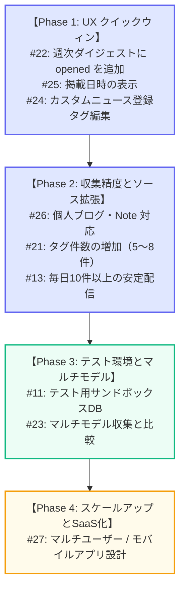

# 引き継ぎドキュメント: バックログ分析 & 開発ロードマップ

本ドキュメントは **Personal News Agent** システムの現状・未対応Issue・推奨開発ロードマップをまとめたものです。別のAIモデルまたは開発者への引き継ぎを目的として作成されています。

> **最終更新**: 2026-06-17（Issue #19 実装完了後に Antigravity が実調査しスナップショットを追記）

---

## 1. システム概要

**Personal News Agent** は Google Apps Script (GAS) と Gemini API を用いた自律型ニュースキュレーションシステムです。

*   **データベース**: Google スプレッドシート（シート: `articles`, `reactions`, `interest_profile`, `sources`, `settings`, `logs`）
*   **AIエンジン**: Gemini API（コストパフォーマンス重視で `gemini-3.1-flash-lite` を使用）
*   **WebアプリUI**: フルレスポンシブ。記事リンクを同一タブで開き、ブラウザバック時に BFCache/pageshow リスナーで評価・タグ編集モードへ自動切替する設計
*   **デプロイ**: `clasp` で管理。GAS WebアプリはサンドボックスのiFrame内で描画されるため、`HtmlOutput` オブジェクトに `.addMetaTag('viewport', 'width=device-width, initial-scale=1')` を呼び出してモバイル表示スケーリング問題を解決済み

---

## 2. 現在のバックログ（未対応 Issue 9件）

GitHubリポジトリ（`wawonpapa/gemini-news-agent`）の未対応Issueと、その技術的スコープ・影響ファイルの一覧です。

| Issue # | タイトル | 技術的スコープ・内容 | 主な影響ファイル |
| :--- | :--- | :--- | :--- |
| **#27** | 将来的なモバイルアプリ化およびマルチユーザー（複数人利用）対応に向けた設計・仕様拡張 | 将来のアーキテクチャ設計。DBクエリの抽象化・GASからのUI分離（REST API化）・`user_id` カラムの設計・OAuth認証の検討。 | アーキテクチャ設計書 |
| **#26** | 自律探索における個人ブログ・技術発信プラットフォーム（Note等）の収集強化 | 検索ドメインとクエリ言語の拡張（日本語クエリの生成、Qiita/Zenn/Note をターゲットに追加、`sources` シートへの登録）。 | [SearchAgent.gs](file:///d:/Git/News_Agent_Test/news_agent_mvp/SearchAgent.gs), [Initialize.gs](file:///d:/Git/News_Agent_Test/news_agent_mvp/Initialize.gs) |
| **#25** | ニュース記事の掲載日時の取得・保存およびメール配信・確認UIへの表示機能の追加 | Gemini スキーマで実際の記事掲載日時を抽出し `published_at` に保存。メール・WebアプリUIに掲載日時を表示する。 | [SearchAgent.gs](file:///d:/Git/News_Agent_Test/news_agent_mvp/SearchAgent.gs), [Notify.gs](file:///d:/Git/News_Agent_Test/news_agent_mvp/Notify.gs), [Actions.gs](file:///d:/Git/News_Agent_Test/news_agent_mvp/Actions.gs) |
| **#24** | カスタムニュース登録フローにおける興味タグの確認・編集機能の追加 | 手動URL登録時に、AIが抽出したタグをユーザーが確認・調整できるようにする。 | [Actions.gs](file:///d:/Git/News_Agent_Test/news_agent_mvp/Actions.gs) |
| **#23** | 探索・解析用AIモデルの複数対応およびモデル別成果比較機能の導入 | 日次バッチで複数の Gemini モデルをループ実行。`article_id` にモデル名サフィックスを付与してモデル間の同一URL許容し、比較ログを記録する。 | [Code.gs](file:///d:/Git/News_Agent_Test/news_agent_mvp/Code.gs), [SearchAgent.gs](file:///d:/Git/News_Agent_Test/news_agent_mvp/SearchAgent.gs), [Sheets.gs](file:///d:/Git/News_Agent_Test/news_agent_mvp/Sheets.gs) |
| **#22** | 週次ダイジェスト（マスタードキュメント）における「開封済み（opened）」記事の収集対象への追加 | 週次ダイジェストに `opened` ステータスの記事を含める（現状は `good` と `read_later` のみ対象）。 | [WeeklyDigest.gs](file:///d:/Git/News_Agent_Test/news_agent_mvp/WeeklyDigest.gs) |
| **#21** | ニュース収集・解析時における付与タグ件数の増加（興味学習の最適化） | Gemini スキーマの抽出上限を増やす（例: 3件 → 5〜8件）。興味プロファイルのより細かいサブトピック学習を可能にする。 | [SearchAgent.gs](file:///d:/Git/News_Agent_Test/news_agent_mvp/SearchAgent.gs), [Actions.gs](file:///d:/Git/News_Agent_Test/news_agent_mvp/Actions.gs) |
| **#11** | テスト実行時に本番データを汚染しない検証環境・テスト手段の構築 | ドライランモード・モック関数・別スプレッドシートIDへの切り替えなどを用いて、本番シートへの書き込みなしにテストできる環境を整備する。 | [Sheets.gs](file:///d:/Git/News_Agent_Test/news_agent_mvp/Sheets.gs), テストスクリプト |
| **#48** | [Refactor] プロジェクト全体の疎結合化・ボトルネック解消・テスト環境サンドボックス化計画 | タイムアウト値未指定（Watchdog無限起動原因）の解消、生絵文字の排除、重複関数のUtils.gs共通化、Actions.gsからのHTMLテンプレート分離、DBインデックスの隠蔽抽象化等 | [Actions.gs](file:///d:/Git/News_Agent_Test/news_agent_mvp/Actions.gs), [Code.gs](file:///d:/Git/News_Agent_Test/news_agent_mvp/Code.gs), [SearchAgent.gs](file:///d:/Git/News_Agent_Test/news_agent_mvp/SearchAgent.gs), [Notify.gs](file:///d:/Git/News_Agent_Test/news_agent_mvp/Notify.gs), [Sheets.gs](file:///d:/Git/News_Agent_Test/news_agent_mvp/Sheets.gs) など |

---

## 3. 推奨開発ロードマップ（4フェーズ）

コード品質の退行リスクを最小化し、実装効率を最大化するための段階的な計画です。



### Phase 1: UX クイックウィン & UI統一
*   **対象Issue**: **#22**、**#24**、**#25**
*   **選定理由**:
    *   **#22** は [WeeklyDigest.gs](file:///d:/Git/News_Agent_Test/news_agent_mvp/WeeklyDigest.gs) の1行ロジック変更で完了する最も軽微な修正。
    *   **#24** と **#25** はどちらも [Actions.gs](file:///d:/Git/News_Agent_Test/news_agent_mvp/Actions.gs)（WebアプリUI）と [Notify.gs](file:///d:/Git/News_Agent_Test/news_agent_mvp/Notify.gs)（メールテンプレート）のHTML/CSSを変更する。まとめて対応することで、UI修正のためのコンテキストスイッチを最小限に抑える。

### Phase 2: 収集精度向上 & ソース拡張
*   **対象Issue**: **#26**、**#21**、**#13**
*   **選定理由**:
    *   **#26**（Note・Qiita・Zennなど日本語個人ブログをターゲットに追加）を実装すると、入力記事プールが拡大する。
    *   その結果、重複フィルタ通過後の記事数が自然に増え、**#13**（毎日10件以上の配信）が副産物として解決される。
    *   タグ数の増加（**#21**）により、個人ブログ由来のサブトピックに対する興味プロファイル学習がより細かくなる。

### Phase 3: テスト環境整備 & AIモデル実験
*   **対象Issue**: **#11**、**#23**
*   **選定理由**:
    *   **#23**（マルチモデル対応）の実装には `articles` シートへの `ai_model` カラム追加（スキーマ変更）とモデル別重複チェックロジックの記述が必要。
    *   本番の日次収集を止めることなくスキーマ移行テストを行うために、先に **#11**（テストサンドボックス）を整備する必要がある。

### Phase 4: 長期的なSaaS化 / モバイルアプリ設計
*   **対象Issue**: **#27**（および関連する **#14** を同フェーズで整理）
*   **選定理由**:
    *   GASバックエンドをスプレッドシートから切り離す（クエリをAPIラッパー層に移行）ための設計仕様書と段階的リファクタリング計画を策定し、`user_id` 導入の基盤を整える。

---

## 4. 現在の環境スナップショット

> このセクションは Antigravity がリポジトリを実調査した上で追記しました。作業開始前の状況把握にご活用ください。

### 4-1. Git の状態

*   **ブランチ**: `main`（`gemini-news-agent/main` と同期済み）
*   **ワーキングツリー**: **クリーン** — 未コミットの変更はありません。実装済みの機能はすべてコミット・PR マージ済みです。
*   **直近のコミット履歴**（新しい順）:

| コミットハッシュ | 説明 | 対応 Issue |
| :--- | :--- | :--- |
| `eaa4ca1` | Merge PR #20: スマホ表示UI改善 | — |
| `0b4a0fe` | スマホ表示時における確認画面のUI・視認性改善 | #19 |
| `5e6f6ff` | Merge PR #18: フィードバック理由追加 | — |
| `5077b89` | フィードバック理由追加の作業 | #2 |
| `263d5e7` | Web App UI リニューアル（同一タブ読書フロー＋タグ編集） | #15, #16 |
| `f9e3f19` | Gemini API コスト最適化（gemini-3.1-flash-lite への移行） | — |
| `d374b24` | Merge PR #12: リアクション済み記事の重複配信防止 | — |
| `f47d56f` | リアクション済み記事の重複配信を防止する | #3 |
| `1c8cab4` | Merge PR #10: カスタムニュース登録フォーム追加 | — |
| `3cf1bc0` | カスタムニュース登録フォームUI＆処理の追加 | #4 |
| `300bd70` | Merge PR #9: 404リンク問題修正 | — |
| `07e8d7c` | 配信ニュースのリンクが404エラーで開けない問題の修正 | #1 |

### 4-2. 実装完了済み Issue

以下の Issue はすでに実装・マージ済みです。**再実装しないでください。**

| Issue # | タイトル | 状態 |
| :--- | :--- | :--- |
| **#1** | 配信ニュースのリンクが404エラーで開けない問題の修正 | ✅ マージ済み |
| **#2** | フィードバック理由追加機能（チェックボックス＋テキストエリア → `reactions.memo` 列） | ✅ マージ済み |
| **#3** | リアクション済み記事（open/good/bad）の重複配信防止 | ✅ マージ済み |
| **#4** | カスタムニュース登録フォームUI（手動URL登録） | ✅ マージ済み |
| **#15** | 同一タブ読書フロー（記事リンクを同一タブで開く）の実装 | ✅ マージ済み |
| **#16** | ブラウザバック後の評価モード自動切替（pageshow + sessionStorage） | ✅ マージ済み |
| **#19** | スマホ表示時における確認画面のUI・視認性改善（レスポンシブCSS＋viewport修正） | ✅ マージ済み |
| **#13** | 収集ニュース件数10倍化とタイムアウト回避分割実行エンジンの導入 | ✅ マージ済み |
| **#34** | 配信ニュースに数週間前の古いニュース記事が混入する問題の改善（5日以上前を除外） | ✅ マージ済み |
| **#38** | URL検証フェーズでのハングアップに対する監視トリガーと自動除外機能 | ✅ マージ済み |
| **#14** / **#37** | 生成AIを用いた内容ベースの類似ニュース重複排除とドメイン優先度選定 | ✅ マージ済み |
| **#41** | 配信メールおよび確認UIからの「読むべき理由」項目の削除 | ✅ マージ済み |
| **#43** | フィードバックUIからの「Bad（低評価）」ボタンの削除と評価の簡素化（過去メール互換含む） | ✅ マージ済み |

### 4-3. GAS デプロイメント情報

`clasp push -f` 後は、必ず新バージョンを作成してアクティブデプロイメントに再デプロイしてください。

```bash
# Step 1: コードをプッシュ
clasp push -f
# Step 2: 新バージョンを作成
clasp version "変更内容の簡単な説明"
# Step 3: アクティブデプロイメントを新バージョンに更新（デプロイメントIDは clasp deployments コマンドで確認）
clasp redeploy <ACTIVE_DEPLOYMENT_ID> -V <新しいバージョン番号>
```

| デプロイメントID | ターゲット | 役割 |
| :--- | :--- | :--- |
| `<ACTIVE_DEPLOYMENT_ID>` | `@26` | **本番（アクティブ）** — 全通知メールに埋め込まれているURLはこちら。必ずここに再デプロイすること。`clasp deployments` で確認。 |
| `<HEAD_DEPLOYMENT_ID>` | `@HEAD` | 開発・テスト用のみ。バージョン管理なしで `clasp push` 最新コードを指す。 |

*   **現在の GAS バージョン**: 26
*   **clasp 作業ディレクトリ**: `<プロジェクトのローカルパス>/news_agent_mvp/`

### 4-4. データベーススキーマ

全シートは GAS プロジェクトにバインドされた単一の Google スプレッドシートに存在します。

#### `articles` シート（15列）

| 列 | フィールド名 | 型 | 説明 |
| :--- | :--- | :--- | :--- |
| 1 | `article_id` | string | 正規化URLのSHA-256先頭16文字。主キー。 |
| 2 | `fetched_at` | Date | 記事を保存した日時。 |
| 3 | `published_at` | string | 記事の掲載日時（現在は空欄 — **#25** の実装対象）。 |
| 4 | `source` | string | ソースドメインまたは名称。 |
| 5 | `title` | string | 記事タイトル。 |
| 6 | `url` | string | 正規化済み記事URL。 |
| 7 | `author` | string | 著者名（取得できた場合）。 |
| 8 | `ai_summary` | string | AIが生成した要約文。 |
| 9 | `category` | string | AIが分類したカテゴリ。 |
| 10 | `tags` | string | カンマ区切りのタグ（例: `"AI, LLM, Google"`）。 |
| 11 | `importance` | string | AIが判定した重要度（`high` / `medium` / `low`）。 |
| 12 | `interest_score` | number | 取得時点の `interest_profile` 重みから計算したスコア。 |
| 13 | `reason` | string | AIが算出した関連性の理由。 |
| 14 | `status` | string | `new` → `notified` → `opened` / `good` / `bad` / `read_later` |
| 15 | `notified_at` | Date | ユーザーにメール通知した日時。 |

> **#23（マルチモデル）実装時の注意**: どのモデルが収集した記事かを記録するため、`ai_model` カラム（16列目）の追加が必要になります。

#### `reactions` シート（6列）

| 列 | フィールド名 | 説明 |
| :--- | :--- | :--- |
| 1 | `timestamp` | リアクション日時。 |
| 2 | `article_id` | `articles.article_id` への参照。 |
| 3 | `action` | `open` / `good` / `bad` / `read_later` のいずれか。 |
| 4 | `url` | リアクション時点の記事URL。 |
| 5 | `title` | リアクション時点の記事タイトル。 |
| 6 | `memo` | フィードバック理由の自由記述（Issue #2 で追加）。形式: `[タグ1][タグ2] 自由記述テキスト` |

#### `interest_profile` シート（4列）

| 列 | フィールド名 | 説明 |
| :--- | :--- | :--- |
| 1 | `tag` | タグ名（例: `"AI"`, `"LLM"`）。 |
| 2 | `weight` | 重み（小数、範囲 0〜10）。good リアクションで +1、bad で -1 更新。 |
| 3 | `updated_at` | 最終更新日時。 |
| 4 | `note` | 重み変動の自動生成メモ。 |

#### `sources` シート（3列）

| 列 | フィールド名 | 説明 |
| :--- | :--- | :--- |
| 1 | `value` | ドメインまたはキーワード。 |
| 2 | `type` | `"focus"` = 検索クエリで優先使用するもの。 |
| 3 | `enabled` | `"TRUE"` / `"FALSE"`。`TRUE` のものだけが使用される。 |

#### `settings` シート（2列）

キーバリュー形式の設定ストア。主なキー: `gemini_model`, `lite_mode`, `notify_email` など。

#### `logs` シート（4列）

`[timestamp, functionName, status, message]` — 行数が300件を超えると30日以上前のログが自動削除される。

---

## 5. 次のエージェントへの制約ルール

1.  **4バイト文字（絵文字）の直接記述禁止**:
    *   GASファイル・JavaScriptの文字列・HTMLテンプレート内に、生の絵文字（例: `📝`、`🚀`、`🎉`）を直接書かないこと。Apps Script での文字コード誤認識によるバグ（文字化け）が発生します。
    *   必ずHTML数値エンティティ（例: `📝` → `&#128221;`）またはUnicodeエスケープシーケンス（例: `👍` → `\ud83d\udc4d`）で記述してください。

2.  **GAS Webアプリのデプロイ手順**:
    *   `clasp push -f` を実行しても、特定バージョン（例: `@23`）を指すアクティブなWebアプリURLは**自動更新されません**。
    *   必ず以下の手順を実行してください:
        1.  `clasp version "変更内容の説明"` — 新バージョンを作成（例: v24）
        2.  `clasp redeploy <デプロイメントID> -V <バージョン番号>` — アクティブエンドポイントを新バージョンに更新

3.  **自動コミットの禁止**:
    *   `git commit` を自動的に実行しないこと。
    *   コミットはユーザーが「コミットして」と明示的に指示した場合のみ実行してください。ステージング（`git add`）や状態確認（`git status`）はいつでも実施して構いません。
